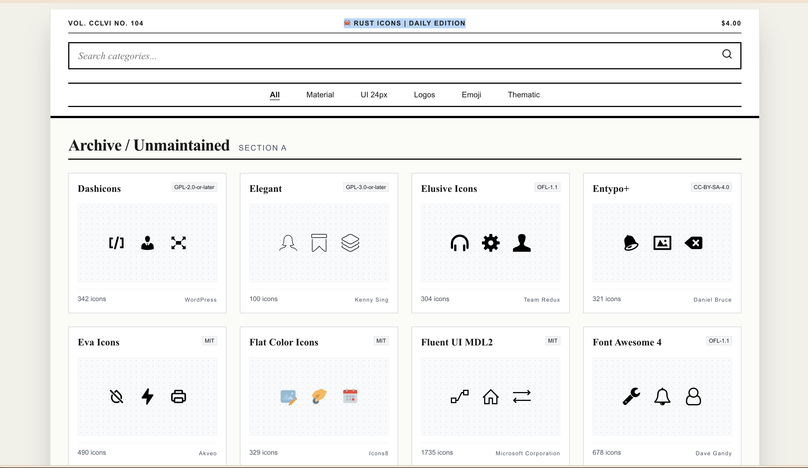
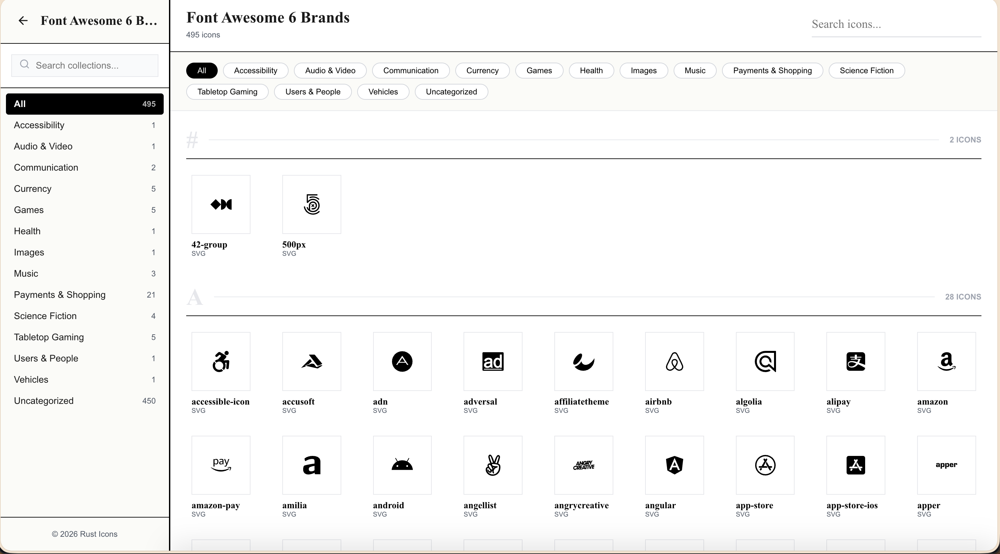
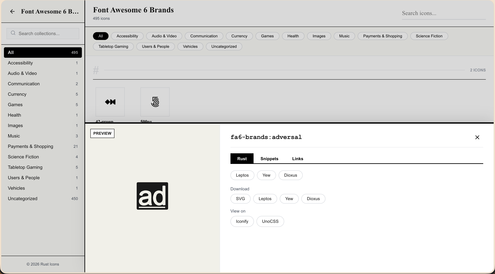

# rust-icons

Icon Explorer with instant search, powered by [Iconify](https://iconify.design/). A Rust port of [Icônes](https://github.com/antfu-collective/icones) that generates components for **Leptos**, **Yew**, and **Dioxus**.

## Screenshots

| Search & browse | Icon detail & copy | Icon bag |
|-----------------|--------------------|----------|
|  |  |  |

## Features

- **Instant fuzzy search** — client-side search across 150k+ icons, no server round-trips
- **Browse 100+ collections** — all [Iconify](https://iconify.design/) collections
- **Generate Rust components** — copy as Leptos, Yew, or Dioxus component code
- **Copy snippets** — raw SVG, component code, data URLs
- **Icon bag** — curate selections, export as component files
- **Dark mode** — system-aware theme
- **Offline-first** — local search; icon data fetched on demand from Iconify API

## Quick start

```bash
# Build all crates
cargo build --workspace

# Run the Leptos app
cd crates/leptos-icons && cargo leptos watch

# Run the Yew app
cd crates/yew-icons && trunk serve

# Run the Dioxus app
cd crates/dioxus-icons && dx serve
```

## Project structure

```
rust-icons/
├── crates/
│   ├── core/           # Framework-agnostic: API client, search, SVG, codegen
│   ├── leptos-icons/   # Leptos app
│   ├── yew-icons/      # Yew app
│   └── dioxus-icons/   # Dioxus app
├── docs/               # Screenshots and docs
└── README.md
```

## Credits

- **[Icônes](https://github.com/antfu-collective/icones)** — original icon explorer by [Anthony Fu](https://antfu.me/) and the [antfu-collective](https://github.com/antfu-collective). This project is a Rust port inspired by its design and UX.
- **[Iconify](https://iconify.design/)** — icon data and API powering 150k+ icons across 100+ collections.
- **[Anthony Fu](https://antfu.me/)** — creator of Icônes; the DX-first, minimal-API philosophy in this repo follows his approach.

## License

MIT
